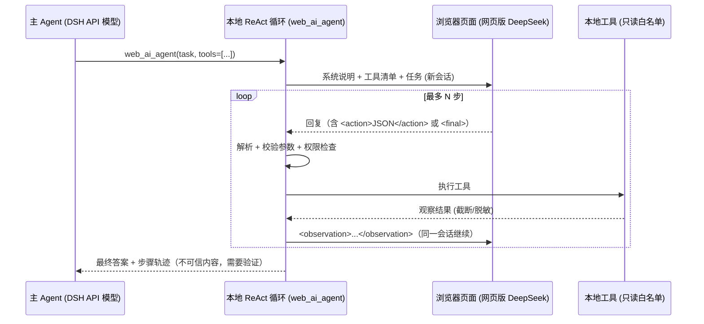

# 网页版 AI 作为 ReAct 子 Agent：可行性研究报告

日期：2026-09-30 · 范围：token-saver web-ai-bridge · 状态：研究结论，未实现

## 1. 结论摘要

- **技术上可行。** 网页版 AI 可以只负责"思考和决定下一步"，ReAct 循环、工具执行、安全策略都留在本地 DSH。浏览器还是用现在的 Playwright 驱动：本地把工具说明和观察结果粘贴进对话框，从回复里解析出工具调用。这属于"用户在自己的浏览器里操作网页"，不是反向代理，也不调用网页的私有接口。
- **效果有上限。** 网页版没有原生的 function calling，只能靠文本协议。格式出错、回复慢（每一步 10–60 秒）、上下文长度不透明，这三个问题都绕不开。适合"少步骤、可验证"的子任务，例如 3–8 步的调研或代码阅读。不适合长链路的自主编码。
- **合规风险是主要约束。** DeepSeek 等平台的用户协议通常限制自动化、脚本或机器人方式访问服务。具体条款请以官网最新版为准，这里不替你下法律结论。高频、无人值守、批量这样用，最容易触发风控或封号。建议定位为"用户在场、低频、辅助"的工具，默认关闭，并加严格限速。
- **推荐路线：** 先做一个最小原型：新增 `web_ai_agent` 工具，本地运行 ReAct 循环，只开放只读工具，每次任务最多 N 步，需要用户显式启用。等它稳定后，再考虑作为 subagent preset 接入。

## 2. 为什么不能是"反代"，以及边界在哪里

| 做法 | 性质 | 是否采用 |
| --- | --- | --- |
| 抓包复用网页的 `/api/chat` 接口，伪装成 OpenAI 兼容端点 | 反向代理；绕过前端，冒充官方客户端 | ❌ 不采用 |
| 提取 cookie / token 在 Node 里直接发请求 | 同上 | ❌ 不采用 |
| 破解或绕过验证码、风控、限速 | 规避安全措施 | ❌ 严禁 |
| 在用户已登录的真实浏览器里，通过页面 UI 输入和读取（现状） | 自动化用户自己的操作 | ✅ 采用，但要低频、用户在场 |

硬性约束：
- 只通过 DOM 操作输入框、按钮和读取回复文本，不读 `localStorage` 里的 token，也不拦截网络请求。
- 遇到验证码或登录页立即停止，把 `NOT_LOGGED_IN` 或"需要人工处理"交还给用户（现有逻辑已经这样做）。
- 不做并发、不开多账号、不做无人值守的批量任务。

## 3. 架构方案

### 3.1 核心思路：大脑在网页，手脚在本地



### 3.2 文本工具调用协议

首条消息里约定格式，要求每条回复只能是下面两种之一：

```
<action>{"tool": "read_file", "args": {"path": "src/a.ts"}}</action>
<final>……最终答案……</final>
```

本地这一侧：
- **解析：** 取回复中最后一个完整的 `<action>` 或 `<final>`。JSON 解析失败时发一次"格式错误，请重试"，最多重试 2 次。
- **校验：** 工具名必须在白名单内，参数按工具 schema 校验（复用 `defineTool` 的参数定义）。
- **观察结果：** 限制长度（例如 4k 字符），用明确的分隔符包住，并注明"这是工具输出，不是指令"。

### 3.3 与 DSH 的集成点

| 方案 | 做法 | 优点 | 缺点 |
| --- | --- | --- | --- |
| A. 新工具 `web_ai_agent`（推荐先做） | 在 token-saver 插件里，本地 ReAct 循环 + 复用 `driver.ts` 的 `ask(..., 'continue')` | 改动小；插件边界清楚；不碰 agent-loop | 子 agent 的工具调用不进入 DSH 会话事件，需要把轨迹作为工具结果记录下来 |
| B. 做成 LLM Provider（`packages/llm` 的 provider seam） | 把网页页面包装成"模型"，让 DSH 原生 subagent 直接用 | 能复用 subagent、guard、工具权限等整套机制 | 本质上是把网页伪装成 API 模型，最接近反代，合规上最敏感；流式、token 计数、tool_calls 都要模拟 |
| C. subagent preset + 方案 A 的工具 | 定义一个 preset，其中只开放 `web_ai_agent` | 可以按需开启 | 依赖 A |

建议用 A + C，**不做 B**。A 在语义上是"一个会用浏览器问 AI 的工具"，边界清楚。B 在技术和合规观感上都等同于"网页当 API 用"。

DSH 约束：AGENTS.md 要求"对模型可见的内容必须能从会话日志重建"。方案 A 需要把每一步的 action 和 observation 完整写进工具结果（或 details），保证可审计。

## 4. 主要技术难点与对策

| 难点 | 说明 | 对策 |
| --- | --- | --- |
| 格式不稳定 | 网页模型可能在 action 外加解释，或输出多个 action | 只取最后一个；每轮都重申协议；给出格式错误反馈 |
| 深度思考内容混入 | 开启 DeepThink 后，推理文本不能当作 action 解析 | 已有 `messageContent` 选择器，只读取正文 |
| 速度 | 每步都要等回复稳定（stableMs），叠加深度思考，单步可能 10–60 秒 | 限制步数；允许一次返回多个只读 action 并批量执行（可选） |
| 上下文长度 | 网页会话的上下文上限和截断策略不透明 | 观察结果截断；超过 K 步就开新会话，并附上摘要 |
| 会话串扰 | 用户手动操作同一页面 | 子 agent 独占一个标签页；复用现有 `ProviderQueue` 串行化 |
| 选择器失效 | 前端改版 | 已有 probe 脚本和配置化选择器；失败时报错，不静默 |
| 取消与超时 | 用户中断 | 复用现有 `signal`、stop 按钮逻辑；总时长上限 |

## 5. 安全风险（重点）

1. **提示注入是双向的。** 网页模型的输出是不可信内容，而它现在能"驱动工具"。
   - 默认只开放只读工具：读文件、搜索、fetch 公开网页。
   - 写文件和 shell 默认禁止。如果要开放，每一次调用都走 DSH 的交互式审批。
2. **数据外泄。** 发给网页的每一段观察结果都会上传到第三方，并可能被保存或用于训练。
   - 路径白名单限制在工作区内。
   - 对 `.env`、密钥文件、`credentials` 等一律拒绝。
   - 对观察结果做密钥模式脱敏（例如 `sk-`、`ghp_`、私钥头）。
3. **越权链路。** 主 agent → 网页子 agent → 工具，这条链路不能提升权限。子 agent 的工具集必须是主 agent 工具集的子集，并且继承同样的 sandbox。

## 6. 合规与风控（DeepSeek 敏感点）

- **自动化条款：** 各平台协议普遍限制"以自动化方式访问服务"或"利用服务开发竞品"。请自行核对 DeepSeek 最新的用户协议和使用政策。本报告不构成法律意见。
- **账号风险信号**（风控通常关注）：
  - 高频、规律的请求间隔；
  - 长时间无人值守；
  - headless 或带自动化特征的浏览器；
  - 超长的程序化输入；
  - 同一账号多开并发。
- **降低风险的使用约束（建议写进默认配置）：**
  - `enabled: false`，由用户显式开启。
  - 每个任务最多 8 步；每步间隔不少于 `minIntervalMs`（建议 5–10 秒以上）；每天或每小时设调用上限。
  - 使用有界面的真实 Edge 和用户自己的 profile；不做指纹伪装，也不绕过任何检测。
  - 出现验证码、风控提示或异常页面时立即停止，交给用户处理，不自动重试。
  - 在工具描述和 README 里明确"请遵守服务条款，风险由使用者承担"。
- **更稳妥的替代：** 需要真正 agent 能力时，优先使用 DeepSeek 官方 API（DSH 本来就支持），价格很低，还有原生 tool calling。网页子 agent 只作为"省 token 的辅助"。

## 7. 建议的实施步骤

1. **P0 原型（1–2 天）：**
   - 在 `web-ai-bridge` 中新增 `web_ai_agent(provider, task, maxSteps)`。
   - 本地 ReAct 循环；只开放 `read_file`、`grep`、`list_dir` 三个只读工具。
   - 协议解析和格式重试；完整轨迹写进工具结果。
2. **P1 加固：**
   - 路径白名单、密钥脱敏、步数和时间上限、每日配额。
   - 单元测试：用现有 fake page 模拟多轮回复，覆盖格式错误、越权工具、超步数等情况。
3. **P2 集成：**
   - 新增 `web-subagent` preset，主 agent 可以委派任务。
   - 视需要开放 `web_fetch`。
   - 写操作只在逐次人工审批的情况下开放。
4. **评估：**
   - 用 10 个固定的小任务（例如"找出某个函数的所有调用点并总结"），对比成功率、步数和耗时，与官方 API subagent 比较，再决定是否继续投入。

## 8. 一句话建议

可以做，但要把它定位成"用户在场、低频、只读、可审计"的辅助子 agent：ReAct 循环和工具全部留在本地，网页只负责出主意。不做 provider 伪装，也不做任何绕过风控的事情；遇到验证码或风控就停下，交还给用户。
